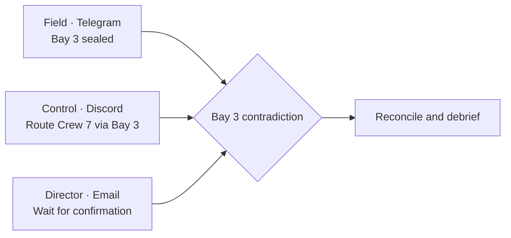
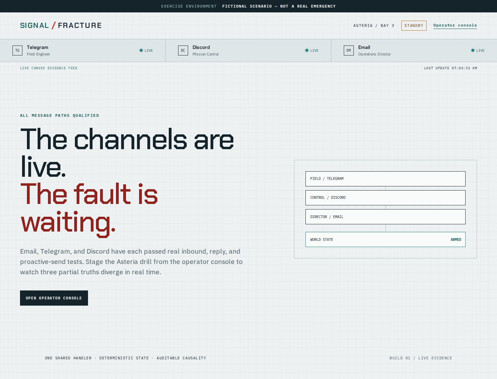
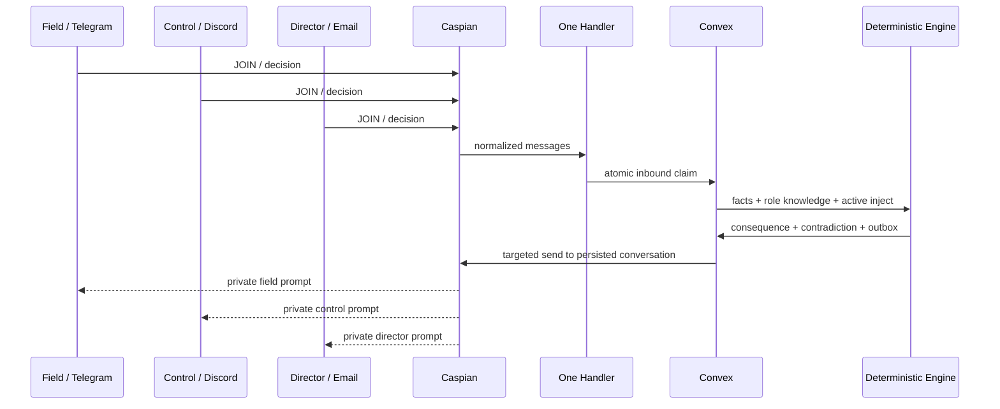

# Signal Fracture

> Chaos engineering for human communication.

**EXERCISE — FICTIONAL SCENARIO — NOT A REAL EMERGENCY**

Signal Fracture runs a short fictional coordination drill across real communication channels. It deliberately gives each role a different subset of facts, applies deterministic consequences to their decisions, detects contradictions, and reconstructs **who knew what, when**.

[View the live qualification surface](https://signal-fracture.vercel.app)

## The 20-second explanation

At Asteria Station, a Field Engineer on Telegram sees rising pressure and seals Bay 3. Mission Control on Discord still has a stale map and routes Crew 7 through Bay 3. An Operations Director on Email delays escalation. Each decision makes sense from that role's local view, but the global plan is unsafe. Signal Fracture exposes the communication fault and privately guides the three roles to reconcile it.



## Current evidence status

The implementation is active, but submission readiness is not claimed yet.

| Requirement        | Current evidence                                                                          |
| ------------------ | ----------------------------------------------------------------------------------------- |
| Official SDK       | Exact `caspian-sdk` 0.6.1 pin and installed type audit                                    |
| One handler        | One registration in [`registerSharedHandler.ts`](apps/agent/src/registerSharedHandler.ts) |
| Email              | Real inbound, shared-handler reply, and proactive persisted-conversation send pass        |
| Telegram           | Real inbound, shared-handler reply, and proactive persisted-conversation send pass        |
| Discord            | Real inbound, shared-handler reply, and proactive persisted-conversation send pass        |
| Durable state      | Production Convex deployment, atomic inbound claim, monotonic checkpoint, outbox          |
| Canonical scenario | Pure and Convex integration flows pass; live three-channel rehearsal pending              |
| Public deployment  | Live evidence dashboard on Vercel; production Convex functions and worker deployed        |

See [`docs/LIVE_TEST_EVIDENCE.md`](docs/LIVE_TEST_EVIDENCE.md) for redacted event evidence and [`TASKS.md`](TASKS.md) for the deliberately conservative completion checklist.



## Why Caspian is essential

Caspian is the shared communication plane, not a notification add-on:

- Email, Telegram, and Discord connect to one `CommClient`.
- Exactly one `client.onMessage(...)` handler receives every text action.
- `message.reply(...)` handles immediate same-thread responses.
- Persisted conversation IDs let `client.sendMessage(...)` deliver later causal injects.
- A durable `dispatchPending(savedSeq)` loop recovers after restarts.
- Caspian message IDs feed Convex idempotency and the audit timeline.

Replacing Caspian with three unrelated bots would remove the one-agent, one-world architecture being tested.

## How it works



The persistent worker, data model, and causal flow are documented in [`docs/architecture.md`](docs/architecture.md).

## Deterministic AI boundary

Gemini may classify natural wording into one of the active prompt's fixed choices, request clarification, summarize a short rationale, or turn deterministic report metrics into optional prose.

Gemini cannot create facts, select transitions, assign roles, declare delivery success, detect contradictions, or execute real-world actions. Exact commands bypass the model entirely, and a total model outage falls back to explicit text choices.

## Reliability

- Atomic inbound message claim before business logic
- Expected inject versions for stale/concurrent response rejection
- Stable outbound idempotency keys
- Atomic outbox claim with bounded retry
- Required-branch pause after permanent delivery failure
- Deterministic per-inject deadlines with an audited safety pause on a miss
- Monotonic Caspian checkpoint in Convex
- Replay-safe restart behavior
- Signed, role-bound, expiring join codes
- Role-private `STATUS` output
- Email quote stripping before parsing
- Public-safe structured logs
- Guarded demo-tenant reset
- Guarded operator start, pause, resume, and abort controls
- Paused sessions hold outbox claims and participant decisions durably, while operator pauses freeze active deadlines
- Role knowledge is recorded only when a participant reply confirms receipt of that inject
- Deterministic 0–100 coordination score from contradictions, resolution time, retries, and delivery failures
- Authenticated JSON export of the completed who-knew-what-when report

## Privacy and safety

Signal Fracture is only for fictional coordination exercises. It does not dispatch emergency services or control infrastructure. Participant-facing injects always begin with the exercise banner.

The public surface uses aliases and redacted evidence. It does not expose participant addresses, provider identities, raw private messages, credentials, or model prompts. Operator actions require a server-side secret.

## Setup

Requirements:

- Bun
- A Caspian API key
- Telegram and Discord bot credentials for those channels
- A Convex project
- A Gemini API key

```bash
git clone https://github.com/Ahm-edAshraf/signal-fracture.git
cd signal-fracture
bun install --frozen-lockfile
cp .env.example .env.local
bunx convex dev
bun run dev:agent
bun run dev:web
```

Fill `.env.local` from [`.env.example`](.env.example). Never commit the local file. The exact verified model IDs are already shown in the example.

### Channel behavior

Participants message the agent first; the canonical demo does not cold-initiate Telegram conversations.

```text
JOIN ASTERIA FIELD <signed-code>
JOIN ASTERIA CONTROL <signed-code>
JOIN ASTERIA DIRECTOR <signed-code>
```

All decisions remain available as text even if optional rich interactions are added later.

## Tests

```bash
bun run check
```

The root check runs formatting, lint, strict TypeScript, unit tests, integration tests, and production builds.

Live tests are opt-in and never message a real account by default:

```bash
ENABLE_LIVE_TESTS=true bun run test:live
```

Critical public dashboard and authentication-boundary checks run in a real browser:

```bash
PLAYWRIGHT_BASE_URL=https://signal-fracture.vercel.app bun run test:e2e
```

## Repository map

```text
apps/agent       Persistent Caspian worker and shared handler
apps/web         Next.js evidence surface
packages/core    Pure scenario, state machine, contradiction, and metrics logic
packages/ai      Narrow Gemini adapter with strict validation
packages/caspian SDK connection and normalization adapter
packages/shared  Cross-package safety primitives
convex           Durable schema and atomic application mutations
tests            Unit, integration, fixture, and opt-in live tests
docs             Decisions, evidence, operations, and submission material
```

## Known limitations

- One fixed fictional scenario
- One active worker replica
- Text is the only qualification-critical interaction path
- Rich interactions and media are not yet live-verified
- A live three-participant canonical rehearsal is still required before submission readiness
- Hosted Caspian gateway behavior remains an external dependency
- This prototype is not for real emergency or operational use

## Buildathon declaration

Original project code was started in the event-window Git repository on 31 July 2026. AI coding assistance is used under human direction. Research and planning files predate the implementation commit and remain clearly separated from claims about working software.

## License

[MIT](LICENSE)
