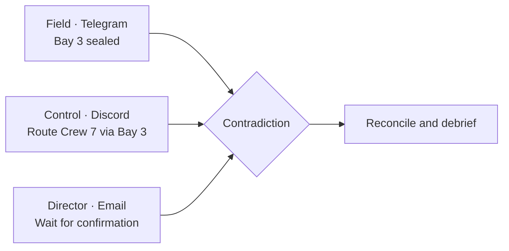
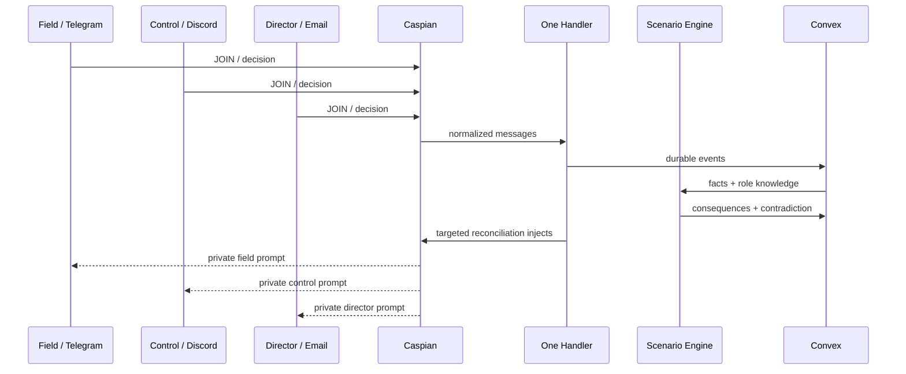

# README_BLUEPRINT.md

Use this as the exact structure for the final `README.md`.

# Signal Fracture

> Chaos engineering for human communication.

Add demo GIF/image.

## 20-second explanation

Explain Field, Control, Director, and the Bay 3 contradiction.

## Demo

- Video URL
- Live dashboard URL
- Agent access instructions
- Screenshot

## Why it exists

Teams test infrastructure failures but not fragmented human knowledge.

## The unforgettable moment



## Why Caspian is essential

Show:

- Telegram + Discord + Email;
- one `onMessage`;
- private conversation IDs;
- proactive cross-channel injects;
- real event evidence.

## How it works



## Deterministic AI boundary

- Gemini: choice classification and report prose
- Code: facts, transitions, contradictions, metrics
- Convex: atomic state and idempotency

## Architecture

Include diagram and stack.

## Caspian compliance

| Requirement           | Evidence        |
| --------------------- | --------------- |
| SDK                   | source/package  |
| 2+ channels           | live evidence   |
| One handler           | source link     |
| Real inbound/outbound | IDs/screenshots |
| Public repo           | URL             |
| Demo                  | URL             |
| Live ready            | rehearsal log   |

## Reliability

- checkpoint;
- replay;
- dedup;
- outbox;
- retry;
- text fallback;
- model outage;
- channel failure.

## Privacy and safety

Fictional-only, role privacy, data minimization, no real operations.

## Metrics

Use real values.

## Setup

Exact fresh-clone commands.

## Channel setup

Email, Telegram, Discord.

## Environment

Link `.env.example`.

## Tests

```bash
bun run check
ENABLE_LIVE_TESTS=true ENABLE_LIVE_SENDS=true bun run test:live
```

## Repository map

Explain folders.

## Known limitations

- one fixed scenario;
- no real emergency use;
- rich interactions optional;
- one worker;
- hosted gateway dependent;
- prototype.

## Buildathon declaration

State event-window code and permitted AI coding assistance.

## License
