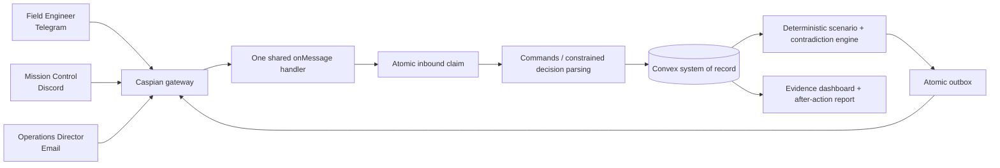

# Signal Fracture architecture

The worker uses a persisted Caspian sequence and `dispatchPending(savedSeq)`. A crash after dispatch but before checkpoint persistence can replay an event. Convex treats a previously processed message as a duplicate, but deliberately reopens a `claimed` or `failed` record so a crash between claim and completion can finish instead of being lost. Expected inject versions and stable delivery keys then suppress repeated consequences.

The runtime reads the authenticated channel capability catalog at startup. Provider-neutral headings and sections are sent on the three supported presentation adapters; decision buttons, reactions, and media are included only when that channel advertises the relevant capability. Every prompt still contains its complete text choices. A capability-gated `onInteraction` adapter, when available, enters through the same atomic inbound claim and decision mutation; the single qualification-critical `onMessage` handler remains registered exactly once.

Global facts and each role's knowledge are separate tables. The public dashboard receives aliases and redacted evidence, never participant addresses or raw private messages.

The browser polls a server-side Next.js route that queries a deliberately public-safe Convex projection. Operator actions use a separate route: the configured secret is validated only on the server, exchanged for a short-lived HttpOnly/SameSite cookie, and never bundled into client JavaScript. Session creation returns single-use role commands once; Convex stores only their hashes. Guarded controls stage, start, pause, resume, abort, and reset the demo tenant.

An operator pause stores both the previous active phase and the pause reason. Pending deliveries are not claimable while paused, participant decisions receive a fictional-exercise pause response without mutating scenario state, and open-inject deadlines shift by the pause duration on resume. Only an operator-originated pause can resume; a delivery-failure or deadline safety pause requires reset so a required invariant cannot be bypassed. Abort cancels open injects and pending or claimed logical deliveries. A provider send already in flight at the moment of abort cannot be recalled, but its late acknowledgement is handled as cancelled without wedging the outbox worker.

The worker also runs an authenticated deterministic deadline sweep. A missed F1 deadline opens C1, as the scenario graph specifies; any later missed decision expires its inject, records audit evidence, and pauses the branch for reset. Delivery acknowledgement is idempotent, so an ambiguous Convex response is retried without another provider send or a shifted deadline.

The runtime does not equate provider acceptance with participant knowledge. A sent delivery opens the response window, but the corresponding knowledge records are written only when that participant replies to the active inject. Reconciliation prompts explicitly state the newly shared facts, allowing the report to show Control's stale `OPEN` observation followed by confirmed knowledge that Bay 3 is `SEALED`.

Every allowed choice also reaches a terminal state. A safe initial branch completes without creating reconciliation work, the canonical branch completes after resolving its contradiction, and a fully answered but unsafe reconciliation ends as failed. Answered injects close, unused injects cancel, and roles cannot remain active after finalization. The public dashboard refreshes every 750 ms and exposes aggregate decision-model and report-narration latency alongside deterministic causal metrics.
