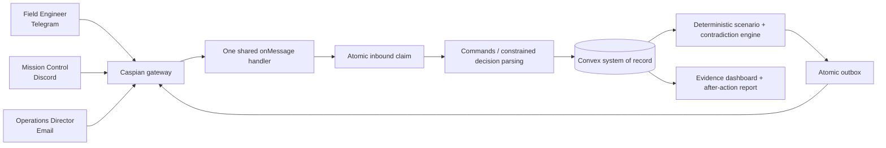

# Signal Fracture architecture

The worker uses a persisted Caspian sequence and `dispatchPending(savedSeq)`. A crash after dispatch but before checkpoint persistence can replay an event; Convex message-ID uniqueness and stable delivery keys suppress repeated consequences.

Global facts and each role's knowledge are separate tables. The public dashboard receives aliases and redacted evidence, never participant addresses or raw private messages.

The browser polls a server-side Next.js route that queries a deliberately public-safe Convex projection. Operator actions use a separate route: the configured secret is validated only on the server, exchanged for a short-lived HttpOnly/SameSite cookie, and never bundled into client JavaScript. Session creation returns single-use role commands once; Convex stores only their hashes.
